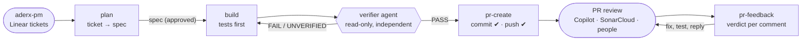

# aderx-dev: from a Linear ticket to an approved pull request

*A Claude Code plugin for the development half of the workflow, and a case study of it building and shipping real work.*

This is the companion to the [aderx-pm case study](aderx-pm-case-study.md). aderx-pm turned an idea into dependency-ordered Linear tickets. aderx-dev takes those tickets to reviewed, merged code.

## What it is

**aderx-dev** is a Claude Code plugin from my [GoGoAderx](https://github.com/super-aderx/GoGoAderx) marketplace. It takes a Linear ticket through a spec, a test-first build, an independent check, a pull request, and the review that follows. At every point where work becomes visible to other people, a person approves it.

An AI coding agent usually fails in three ways: it guesses at requirements, it grades its own homework, and it publishes things nobody approved. aderx-dev has a structural answer to each:
- **Guessing:** a written spec is the contract, with explicit interfaces, error behaviour and acceptance criteria.
- **Self-grading:** a separate, read-only verifier agent decides whether the work passes.
- **Unapproved publishing:** commits, pushes, Linear updates and review replies each wait for an explicit yes.

```
/aderx-dev:init         one-time per repo → .aderx-dev/config.json (base branch, Linear team, per-area commands)
/aderx-dev:plan CSA-11  Linear ticket → spec you approve → .aderx-dev/specs/CSA-11.md
/aderx-dev:build        implement the spec, tests first → independent verifier checks every AC
/aderx-dev:pr-create    commits + PR from the spec and the real diff (approve commits, then approve the push)
/aderx-dev:pr-feedback  triage Copilot/reviewer comments → fix → commit, push, reply in each thread
```

## How it works



The spec file (`.aderx-dev/specs/<TICKET>.md`) is the handoff between steps. Each step reads it and adds to it, from requirements and contracts to deviations, implementation notes, the verifier's report and the PR link. The chat can be cleared between steps without losing anything.

| Step | What it does | Asks before |
|---|---|---|
| **init** | Detects the base branch, the Linear team key, and each area's lint, typecheck, test and format commands from CI and the manifests. | Writing the config |
| **plan** | Reads the ticket and its comments, explores the code, and writes a spec covering the interface, error behaviour, approach, affected files, acceptance criteria and test plan. If the ticket came from aderx-pm, its contracts are settled, not redesigned. | Treating the spec as approved |
| **build** | Tests first, then code. It runs every area's checks, then hands the spec (and only the spec) to the `verifier` subagent, for up to three rounds. | Nothing locally, but it stops on significant deviations |
| **pr-create** | Pre-flight: the right branch, nothing secret staged, checks rerun. Then commits and a PR body built from the spec and the real diff. | Creating the commits; **pushing, as a separate question**; updating Linear |
| **pr-feedback** | Reproduces each review comment before trusting it, gives it a verdict, and fixes the agreed ones with regression tests. | Which comments to fix; commit, push and replies together |

Two hooks enforce the rules no matter what the model decides. `format_on_edit` formats each edited file with its area's formatter. `guard_git` blocks force pushes, pushes to protected branches, `git push --all` and `gh pr merge`.

## Case study: shipping Constella's warehouse integration and the first AI ticket

**Constella** is a sales-analytics app built on a data warehouse. Two pieces of work went through aderx-dev.

### 1. Handling review on PR #9 with pr-feedback

PR #9 connected Constella's frontend and backend to the warehouse. GitHub Copilot left **6 review comments**, and SonarCloud's quality gate failed on its security rating.

**Collect and judge.** The skill pulled every unresolved thread with GraphQL, plus SonarCloud's findings through its API. The gate failure turned out to be a single "hard-coded password" in the CI workflow; the other 19 findings were code smells that didn't block the gate. Each comment was then checked against the real code before anyone trusted it:

| Comment | How it was checked | Verdict |
|---|---|---|
| A null `last_complete_day` gives a 500, not a 503 | Code reading plus a regression test | Valid |
| Paging compares SKUs under a different collation than the ORDER BY | **Reproduced in Postgres:** under `en_US`, `'HSX-TOTE' > 'HS-YOGURT'` is false; under `"C"` it's true | Valid |
| All 20 networks are loaded up front | Measured: 0.6 s in total, about 100 pairs each; one failure still breaks the page | Needs a decision, so it became follow-up ticket CSA-21 |
| A product with zero sales shows as −100% | Code reading | Valid |
| Vite ignores `VITE_API_PROXY` from `.env` files | **Reproduced** with a stand-in server on port 9999: the proxy still hit port 8000 (502) | Valid |
| Label description says "revenue", but the code ranks by connectivity | Code reading | Valid |
| SonarCloud: "PASSWORD detected" in CI | Code reading | Valid for the gate |

**Fix, test first.** Each bug got a regression test that failed first. One test **passed when it should have failed**: with pages of 3, no page ever ended at the one boundary where the two collations disagree. The skill noticed, switched to paging one product at a time, and the test then failed for the right reason before the fix went in. The CI Postgres moved to trust auth, which removed the password literal without weakening anything. Backend tests went from 33 to 37.

**Publish carefully.** The commit and push were approved together, but the push from the session failed on SSH. The skill stopped and reported it. It didn't try HTTPS, another remote or `gh`. I pushed from my terminal. Replies went into all six threads only **after** the fix was on the PR, so no reply ever pointed at code reviewers couldn't see. CI and SonarCloud went green, and the PR merged.

### 2. Setting up a repo: init

`init` read the repo instead of asking me to type config:
- **Base branch:** `main`, from `origin/HEAD`.
- **Linear team:** `CSA`, from commit subjects.
- **Areas:** `backend` (uv) and `frontend` (npm), with commands taken from the CI workflows.

It also flagged things I'd otherwise trip on later:
- The backend's API tests skip silently without a test database.
- The frontend has no tests and no formatter.

Personal working files (`.aderx-dev/current`, `specs/`) went into `.git/info/exclude`, so they never get committed.

The gates showed up early, too. An attempt to `build` before `init` stopped at step 1 with "run `/aderx-dev:init`". It didn't guess at commands.

### 3. Building CSA-11 end to end: plan, build, pr-create

CSA-11 was the wave-0 "contracts" ticket filed by aderx-pm: AI schemas, errors, settings, the model-client interface, stub routes and frontend API types, which six later tickets depend on.

**Plan.** The ticket linked to aderx-pm's tech plan, so its contracts were already settled. At my request, the spec was written straight from them (interface table, error behaviour, 9 acceptance criteria, test plan) instead of being redesigned.

**Build.** It worked on branch `feat/CSA-11`, off `main` after PR #9 merged. Highlights:
- **Tests first.** The 25 new tests failed at collection because the module didn't exist yet, then passed once it did.
- **A future-proofing catch.** The "AI not configured" tests only passed because my `.env` had no OpenAI key. They would have broken the day I added one. The tests now clear the AI settings themselves, and I confirmed they pass *with* a key set.
- **Evidence for the untestable criterion.** The frontend has no test runner, so the client was loaded through Vite against the running API and exercised live: the 503 with `code: "not_configured"`, a 422, an aborted request and an unreachable API.
- **Honest deviations.** Four minor ones were written into the spec before verification, for example where the test fixture lives and why aborted requests rethrow `AbortError`.
- **Independent verification.** The verifier got only the spec path. It reran every check and checked each criterion and every interface item. It also probed on its own: over-limit lists, nested unknown fields, and that model-output schemas have no optional fields. It searched the diff for shortcuts (skip markers, `noqa`, `ts-ignore`, debug output) and confirmed no dependencies changed. **PASS on the first round.**

**PR.** Pre-flight reran every check and kept `.aderx-dev/` and the unrelated design docs out of the commit. It produced one commit, `feat(CSA-11): …`: 14 files, +938 −8. The push was its own question. When the session hit SSH again, I pushed. I had already opened PR #10 myself, so the skill **updated that PR's description** instead of opening a duplicate. The new description has the summary, changes, interface changes, the testing section with commands and results, an acceptance-criteria table, deviations, risks and reviewer notes.

Linear had no "In Review" status, so the skill **asked** instead of picking one. The ticket went to In Progress, with the PR attached and a comment linking it. It also noticed one checklist item from the ticket that hadn't been run (`npm run build`), ran it, and confirmed it passed. **Copilot approved PR #10 with no comments.**

## Results

| | |
|---|---|
| Review comments triaged on PR #9 | 6 from Copilot + 1 failing SonarCloud gate |
| Reproduced before fixing | 2 (collation, Vite env), plus a 0.6 s measurement for the design question |
| Fixed / answered with a follow-up ticket | 5 + the gate / 1 (CSA-21) |
| Regression tests added on PR #9 | 4, each failing before its fix |
| CSA-11 acceptance criteria | 9 / 9 PASS, first verifier round |
| CSA-11 backend tests | 62 passing (37 → 62) |
| Recorded deviations | 4, all minor, all in the spec before verification |
| Publishing actions taken without approval | 0 |
| Workarounds attempted after a failed push | 0 |
| Review outcome | PR #9 merged; PR #10 approved by Copilot with no comments |

## Design principles

- **The spec is the contract.** Interfaces, error behaviour and acceptance criteria are written before code, so the builder doesn't improvise and the reviewer knows what "done" means.
- **The builder doesn't grade itself.** A read-only verifier with no knowledge of the build process decides PASS or FAIL from evidence.
- **Tests first, and tests that can fail.** A regression test that passes before the fix proves nothing, so the workflow checks that it fails first.
- **Separate approvals for separate consequences.** Commits are local and reversible; a push is public. They're approved separately, and a declined or failed push is never worked around.
- **Reviewers can be wrong; so can their examples.** Every comment is reproduced or reasoned through before it's fixed. Design questions go back to the owner instead of being quietly "fixed".
- **Report what actually ran.** PR descriptions list the exact commands and their real results. A check that wasn't run is either run or not claimed.
- **Guardrails outside the model.** Hooks block force pushes, pushes to protected branches and merges, whatever the conversation says.

## Try it

```
/plugin marketplace add super-aderx/GoGoAderx
/plugin install aderx-dev@gogoaderx
/aderx-dev:init
/aderx-dev:plan <TICKET-ID>
```

You need `git`, an authenticated `gh`, a Linear connection, and `python3` for the hooks. It pairs with **aderx-pm**, which produces the tickets and the tech plan that `plan` builds on.
