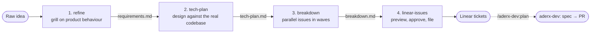

# aderx-pm: from a feature idea to Linear tickets

*A Claude Code plugin for product management, and a case study of one feature taken through it end to end.*

## What it is

**aderx-pm** is a Claude Code plugin from my [GoGoAderx](https://github.com/super-aderx/GoGoAderx) marketplace. It turns a vague feature idea into Linear tickets that are ready to build. Several engineers or AI agents can then pick those tickets up in parallel without stepping on each other.

The usual failure between "we should build X" and "someone is coding X" is not a lack of effort. Requirements stay vague, design decisions get made silently in code, and work is split in ways that make people collide in the same files. aderx-pm makes each of those steps explicit, reviewable and repeatable.

```
/aderx-pm:pm             run the whole pipeline, with a checkpoint after each stage
/aderx-pm:refine         vague idea      → docs/specs/<slug>/requirements.md
/aderx-pm:tech-plan      requirements    → docs/specs/<slug>/tech-plan.md
/aderx-pm:breakdown      design          → docs/specs/<slug>/breakdown.md
/aderx-pm:linear-issues  breakdown       → Linear parent + sub-issues, docs/specs/<slug>/linear.md
```

## How the pipeline works



Each stage writes a markdown file that the next stage reads. You can stop at any point, edit a file by hand or share it for review, and resume later.

| Stage | Role it plays | Gate before moving on |
|---|---|---|
| **refine** | A sceptical product manager. It asks about users, flows, edge cases and success, never about technology, in small rounds with concrete options to choose from. | A readiness checklist, plus acceptance criteria that the owner confirms. |
| **tech-plan** | An architect who reads the codebase first. It traces every requirement to a component and pins down the contracts between them. | Real design forks are put to the owner as options with trade-offs, never chosen silently. |
| **breakdown** | A tech lead splitting the work. It puts contracts first, then vertical slices, with file ownership per issue. | `check_breakdown.py` computes the dependency waves and fails on cycles, unknown dependencies, or two issues in the same wave touching the same file. |
| **linear-issues** | A careful release manager. | A full preview, a duplicate check, and nothing created without an explicit yes. Every ticket created is recorded locally, so a re-run is safe. |

## Case study: an AI assistant for Constella

**Constella** is a sales-analytics app built on a data warehouse. It shows which products are bought together, how the store's product communities are structured, and how campaigns perform. Its "Constella AI" assistant was a scripted engine: it recognised a fixed set of question types and filled in real figures. The goal was to replace it with a real LLM (OpenAI, chosen by the owner) using a **one-call** design. The backend builds a briefing of the store's data, sends it with the question in a single model call, and checks every number in the answer against that data.

I ran it as `/aderx-pm:pm design the onecall ai feature`, with the slug `onecall-ai`.

### Stage 1: refine

The skill first played back its understanding and its assumptions, then questioned the owner in **four short rounds**. Each round offered concrete candidate answers.

1. **Scope and failure:** what ships first, what happens when the AI is down, whether it may draft campaigns, and what to do with questions the data can't answer.
2. **Behaviour:** what the AI writes in the report, what happens to a number it can't back up, whether follow-ups remember context, and how long to wait.
3. **Success and limits:** how to measure success, spending limits, data sharing with the provider, and languages.
4. **Details that followed:** where to pick the language, the default daily cap, and a longer wait for the report.

Several answers changed the feature in ways a default wouldn't have:
- The owner asked for fallback answers to carry a visible **"AI UNAVAILABLE"** mark.
- The report joined the first release.
- The daily cap came down to 50.
- Answers became bilingual: English and 繁體中文.

**Output:** `requirements.md`, marked confirmed, with **13 functional requirements**, **16 Given/When/Then acceptance criteria** (each linked to its requirement), explicit out-of-scope items, edge cases, constraints, three accepted assumptions, and one open question.

### Stage 2: tech plan

Before designing, the skill read the code: the FastAPI routes → services → repository layering, the per-request tenant scoping, the frontend's data store and scripted engine, and the report generator. It then brought **three genuine design forks** to the owner, each with pros and cons:
- Should the backend or the browser build the data briefing?
- Where should the report's facts come from?
- Where should the daily limit be counted?

The owner took the recommended option each time. Everything that already had a convention in the codebase it simply followed, and noted that it did.

**Output:** `tech-plan.md` with:
- **Components**, each mapped to the requirements it covers. All 13 are covered.
- **Exact contracts:** three endpoints, request and response shapes, six error codes and the status code each maps to, and the rule for checking figures.
- **12 recorded decisions**, each with its reason and the alternatives. For example: one model call with no agent loop; the fallback runs in the browser; every number is checked, not just the sourced ones.
- **Risks and rollout.** Nothing changes until the owner sets the key.

### Stage 3: breakdown

The first split had a problem: both backend services lived in one file behind one routes file, so they couldn't be built at the same time. The skill fixed the design rather than accept a false dependency:
- It split the services into `ask.py` and `report.py`.
- It moved the routes and service stubs into the wave-0 contracts issue.
- It updated the tech plan to match.

It also found an issue whose file list left out a route file it had to edit, which would have hidden a real conflict, and added it before validating.

```
$ python3 check_breakdown.py docs/specs/onecall-ai/breakdown.md
Waves:
  wave 0: I1
  wave 1: I2, I3, I4, I5, I7, I8
  wave 2: I6, I9
  wave 3: I10
Issues: 10 · waves: 4 · max parallel: 6

OK: graph is acyclic and no same-wave file conflicts.
```

**Output:** `breakdown.md` with **10 self-contained issues in 4 waves**, a maximum of **6 in parallel**, and a critical path of I1 → I4 → I6 → I10. The first issue pins every shared contract and wires the routes to stubs. That means the two frontend issues can integrate on day one: they fall back gracefully until the backend lands. A coverage table maps every requirement and acceptance criterion to the issues that deliver it.

### Stage 4: Linear

The skill confirmed the team, project and labels still existed, and searched for duplicates (none). It then showed a preview table with the full rendered description of the parent and one sub-issue. Only after an explicit "yes" did it create, in dependency order:

- **1 parent issue:** CSA-10 *Constella AI: one-call answers (OpenAI)*.
- **2 Linear documents** attached to it: the requirements and the technical plan.
- **10 sub-issues:** CSA-11 to CSA-20, created wave by wave so every blocker existed before the tickets that reference it.

Each ticket follows one template: a user story, the proposed solution grounded in real files, checkbox acceptance criteria, blockers, and a link back to the spec folder. After creation, the skill replaced placeholder "downstream" references with real ticket ids, so the text matches the blocked-by relations. It recorded everything in `linear.md` and tagged each heading in `breakdown.md` with its ticket id, so the local spec and the tracker stay linked.

The hand-off to development is one command per ticket: `/aderx-dev:plan CSA-11` turns it into an implementation spec, using the tech plan's contracts as settled.

## Results

| | |
|---|---|
| Stages run | 4 of 4, with a human checkpoint after each |
| Question rounds in refine | 4, all multiple choice with room for custom answers |
| Functional requirements / acceptance criteria | 13 / 16, all traced to issues |
| Design decisions recorded | 12, of which 3 were chosen by the owner |
| Issues / waves / max parallel | 10 / 4 / 6 |
| File conflicts in the same wave | 0, machine-checked |
| Linear artefacts | 11 tickets (CSA-10 to CSA-20) and 2 spec documents |
| Duplicate tickets created | 0 |

All of it happened in a single session, from a one-line prompt to a tracked, dependency-ordered backlog.

## Design principles

- **Files are the interface.** Every stage reads and writes plain markdown in the repo, so the output is reviewable in a PR and can be edited by hand. It also survives the end of any chat session.
- **Humans decide, the tool proposes.** Requirements are confirmed, design forks are chosen by the owner, and tickets are approved before they exist. Defaults come with a recommendation, never silently.
- **Keep product and technology apart.** Refine never asks about frameworks. Technical remarks the owner volunteers are parked for the tech plan instead of shaping requirements too early.
- **Contracts first, then parallel work.** A small wave-0 issue pins the shared shapes, so everything after it can proceed independently.
- **Verify mechanically where you can.** Dependency waves and file ownership are checked by a script, not by eye.
- **Safe to re-run.** Linear creation checks for duplicates and records its progress locally, so an interrupted run resumes instead of double-filing.

## Try it

```
/plugin marketplace add super-aderx/GoGoAderx
/plugin install aderx-pm@gogoaderx
/aderx-pm:pm <describe your feature>
```

You need a Linear connection (sign in through `/mcp`) and `python3` for the breakdown checker. The companion plugin **aderx-dev** takes each ticket from spec to verified pull request.
