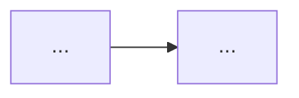

# gogoaderx plan

Produce a spec at `<specs.dir>/<TICKET>.md` (the specs directory is `specs.dir` in the config, default `.gogoaderx/specs`) that the `build`, `pr-create` and `pr-review` steps will treat as the source of truth. The reader of this spec has none of this conversation, so the spec must stand on its own. Vague specs are the main way this workflow fails, so spend effort here.

User argument: `$ARGUMENTS`

## Steps

### 1. Preconditions
- Read `.gogoaderx/config.json` from the repo root. If it is missing, tell the user to run `/gogoaderx:init` and stop.
- Load the active profiles: for each name in the config's `profiles`, read `.gogoaderx/profiles/<name>.md` (skip any that are missing). You will use their `Where to look`, `Testing conventions` and `Dependency manifests` sections. With no profiles, work from what the codebase itself shows.
- Resolve the ticket id from the argument (a Linear URL like `https://linear.app/<workspace>/issue/ENG-123/<slug>` contains it). A bare number such as `123` means `<linear.team>-123`, using `linear.team` from the config. If there is no argument, ask for one.
- If `<specs.dir>/<TICKET>.md` already exists, show its status. Ask whether to revise it or start over. Never overwrite silently.

### 2. Fetch the ticket
Use the Linear MCP tools to get the issue: title, description, priority, labels, status, assignee, parent and sub-issues, related issues, attachments and linked docs, and **all comments** (they often hold the real requirements or later corrections). If the Linear tools are not authenticated, tell the user to run `/mcp` and stop.

Note anything ambiguous, contradictory or missing. Those become open questions, not guesses.

### 3. Size check
If the ticket bundles independently shippable pieces, or you expect it to touch more than roughly 15 files or to change several areas substantially, propose splitting it into phases and ask the user how to proceed. One reviewable PR per spec is the goal.

### 4. Explore the codebase
Launch the `explorer` subagent (`gogoaderx:explorer`) with the ticket summary and the specific questions you need answered. Launch one per area in parallel when the ticket spans several areas. It reads the active profiles' `Where to look` sections itself. It is read-only and returns relevant files, existing patterns to reuse, existing tests, callers and consumers, and risks. Also ask it which existing dependencies already cover the need, so the spec does not add a new one when a current one would do. Reading real code is what makes the "affected scope" section trustworthy instead of a guess. Read the key files it points to yourself before relying on its conclusions.

### 5. Draft the spec, in this order
Each stage below feeds the next, and the order is what keeps the spec coherent: pin down *what* is needed, then the contract with the outside world, then the design, then the work. Do the thinking in this order even though you write the result into the skeleton at the end.

1. **Define the requirements.** Restate in your own words what is being built, its goal, and the situations it will be used in: who uses it, when, and why. Separate goals from non-goals, and write down constraints (performance, compatibility, environment). Anything you cannot pin down becomes an open question with your recommended answer.
2. **List the interface and inputs/outputs.** Before deciding how it is built, define how it is used from the outside. Cover whichever kinds apply: command-line arguments, HTTP endpoints, function or module signatures, UI props and events, messages or events emitted, config keys, data schemas.
   - For every parameter or field: name, required or optional, type, default and meaning.
   - Input format and output format, down to file formats, field or column names and types, ordering and units.
   - **Error behavior:** a table of each failure condition and what happens (message, exit code or status code, UI state, whether partial output is kept, whether it retries). Error handling left unspecified is where builders improvise.
   - Two or three concrete examples: a realistic input and the exact expected output.
3. **Draw the architecture.** Mermaid, in the same diagram style for before and after so differences are easy to see. Choose the type that fits: `flowchart` for logic or control flow, `sequenceDiagram` for request flows across services, `erDiagram` for data models, a `flowchart` of the module or component tree for structure. Keep it to about 12 nodes and mark new or changed nodes. For a brand-new component with no "before", show only the target architecture and the data flow. If the change is small and local, write "No diagram: the change is local to <X>" rather than forcing one.
4. **Decide the dependencies.** Use the profiles' `Dependency manifests` sections (or the repo's own manifests) to see what is already available. List what the builder should reuse, any new dependency that is allowed (name, version constraint, and why it is needed), and state that nothing else may be added. If none are needed, write "No new dependencies". A dependency the spec does not list is a scope violation.
5. **Break it into steps.** Numbered steps in build order, each small enough to verify on its own. Each names concrete file paths and says what changes and why, and points to existing helpers and patterns to reuse (with paths) so the builder extends the codebase instead of reinventing it.
6. **Write acceptance criteria and the test plan.** Criteria are numbered `AC1`, `AC2`, ... in Given/When/Then form; each must be observable and testable, and every row of the error-behavior table needs a criterion. These IDs are reused by the verifier, the PR description and the reviewer, so keep them stable and unambiguous. The test plan maps every AC to at least one test: level (unit, integration, end-to-end), where it lives, and what it asserts. Follow the active profiles' `Testing conventions` and, above all, the patterns in neighbouring tests. Add manual verification steps only for things automation cannot cover.

For the **affected scope** section, give a table of paths with new/modify/delete and the reason, plus a blast-radius list: callers and consumers, API contracts, DB migrations, config or env vars, feature flags, docs. Only list what you verified in the code.

Do not write implementation code in the spec beyond signatures or short illustrative snippets.

Write the result to `<specs.dir>/<TICKET>.md` with `status: draft`, using this skeleton. Fill `base_branch` from config, `base_commit` from `git rev-parse HEAD` on the base branch, and `branch` from `git.branchPattern`. Keep the headings exactly as written (unnumbered); other steps refer to them by name. Omit an interface sub-section that does not apply rather than leaving it empty.

````markdown
---
ticket: ENG-123
title: <ticket title>
linear_url: <url>
status: draft            # draft → approved → built → pr-open
created: <YYYY-MM-DD>
approved_at:
base_branch: main
base_commit: <sha>
branch: eng-123-short-slug
areas: [<area names from config>]
---

# ENG-123: <title>

## Overview
What is being built (its name), the goal, and the intended usage scenarios: who uses it, when, and why. Include anything from comments or linked docs that changes the interpretation.

## Goals and non-goals
**Goals:** ...
**Non-goals:** ... (tempting things the builder should not do)
**Constraints:** performance, compatibility, environment.

## Interface and I/O contract

### Interface
| Name | Required | Type / default | Description |
|---|---|---|---|

### Input
Formats, sources, validation rules.

### Output
Formats, field or column names and types, ordering, units.

### Error behavior
| Condition | Behavior (message, exit code / status / UI state, partial output?) |
|---|---|

### Examples
Input → expected output, for two or three realistic cases.

## Architecture

### Before


### After


## Dependencies
- **Reuse (already in the project):** ...
- **New (allowed):** name, version constraint, why. Or "No new dependencies".
- **Not allowed:** any dependency not listed above.

## Approach
1. <step> - `path/to/file`: what and why.

## Affected scope
| Path | Change | Why |
|---|---|---|

**Blast radius:** callers/consumers, API contracts, migrations, config/env, flags, docs.

## Acceptance criteria
- **AC1** Given ..., when ..., then ...

## Test plan
| AC | Level | Test location and name | What it asserts |
|---|---|---|---|

**Manual verification:** ...

## Risks and open questions
- <question> - recommendation: ...

## Deviations
_Filled in by build._

## Implementation notes
_Filled in by build._

## Verification
_Filled in by build (verifier report)._
````

### 6. Review with the user
Tell the user where the draft file is, then summarize it in chat: the requirements in a few lines, the interface and input/output contract (including how errors behave), the dependencies, the approach, the affected scope, the acceptance criteria in full, how it will be tested, and the open questions with your recommendations. Ask them to approve or say what to change.

Revise the file after each round of feedback and say what changed. Treat only a clear go-ahead ("approve", "LGTM", "looks good, go") as approval; a comment or a partial answer is not approval.

### 7. Save on approval
Only after explicit approval:
- In the spec frontmatter set `status: approved` and `approved_at` to now.
- Write the ticket id to `.gogoaderx/current`.
- Optionally offer to post a short summary of the plan as a Linear comment. Do it only if the user says yes.
- Tell the user the spec is saved and that the next step is `/gogoaderx:build <TICKET>`. Because the spec is on disk, running `/clear` first is fine and keeps the builder's context clean.
